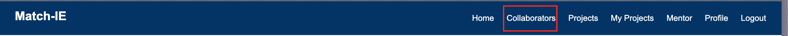
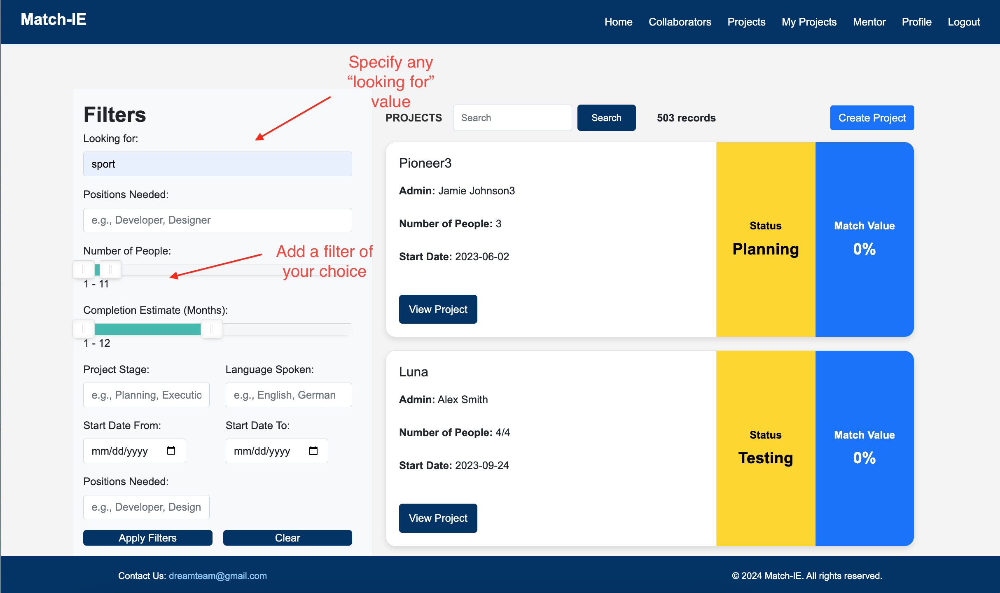
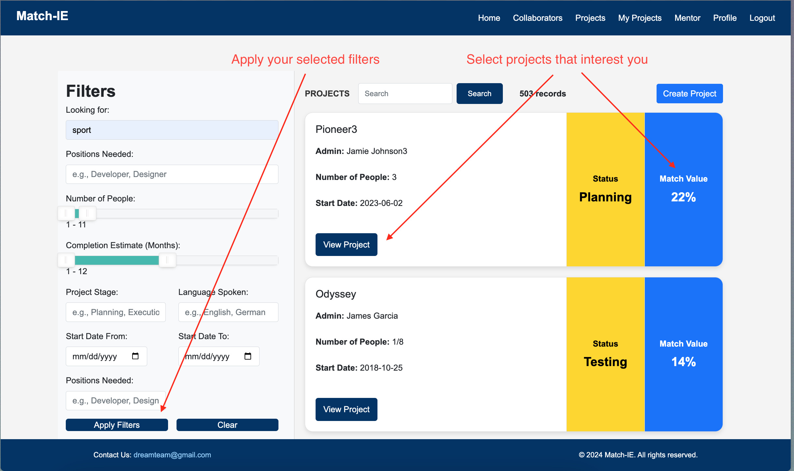
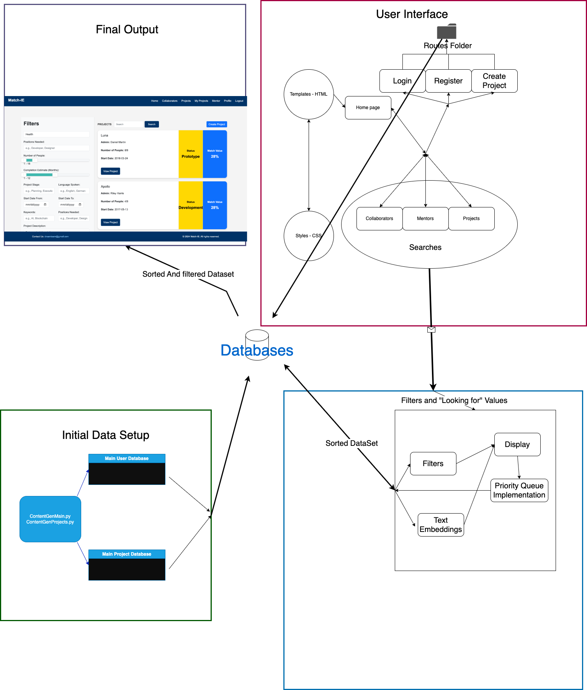

# <span style="color:blue">Match-IE</span>


## 💡About

Match-IE offers the opportunity for students as well as alumni to collaborate in an effortless way.


## 🔀 Installation
Assuming we have made it public or have shared it:

```git clone https://github.com/tomvlt1/Datastructures```

Then navigate to the app folder within the Datastructures folder

``` cd Datastructures/app ```

## ⬇️ Imports 
This project was primarily developed and tested on **macOS Monterey (Version 12.6.9), macOS Sequoia 15.1, Windows 11 Home 23H2**. It should also work on other Unix-based systems or Windows with the required dependencies. 


This will ensures that you are using the correct python version and the correct libraries prior to running the project

``` pip3 install -r requirements.txt ```

or

``` pip install -r requirements.txt```

We used the following libraries and python version 

```Python 3.12.1, Flask==3.1.0, openai==1.55.3, pandas==2.2.3, pdfminer==20191125, pdfminer.six==20240706, torch==2.2.2, transformers==4.46.2, numpy<2```


## 💻 Usage
``` python3 main.py ```

or 

```python main.py```

This will open the Webpage.


## 📋 Guide

Now that you are on the Webpage feel free to go through the home page and see more about the history of Match-IE.

To fully test all the user features we have created a step by step guide. This is only a _recommendation_ and you are not **obliged** to use it.

1.**Discovery** Read through the home page and learn more about the company

2.**Discovery part 2** Perhaps go to the LinkedIn of one of the members

**Account creation** Login or create an account and enter your data, you will be added to our database for others to find you.


4. **Page Selection** Now you can start looking for whatever suits your needs best on each page.

    a. **Look for Collaborators**: If you are looking for people to work with or join one of your projects.
   


    b. **Look for Projects**: If you are looking to join a pre-existing team/project.
    


    c. **Look for a Mentor**: Perhaps you want someone more experienced to give you some tips for a certain industry you are looking to break into.
    
6. **Searching**:
    
    a. **Filters**, first remove out any section of people or projects that you are not interested in.
    
    b.**Interest**, input whichever specific subjects or degree or position you are looking for and our word embedding technology will recommend the people and projects that are closest to your desires. You will see the match value displayed to you.
   

    

8. **Reaching out**, you will be able to see an email address that you will be able to reach out to.

9. **Enjoy!**

10. **Come back**,Return to the platform to update your information or re use the features to your hearts desire.

## 📐 High Level Overview of the architecture


## 📃 Authors

- [@JavierCruz2](https://github.com/JavierCruz2)
- [@tomvlt1](https://github.com/tomvlt1)
- [@carlopfialdini](https://github.com/carlopfialdini)
- [@guittoi](https://github.com/guittoi)


## 📌Acknowledgements

 - [Awesome Readme Templates](https://awesomeopensource.com/project/elangosundar/awesome-README-templates)
 - [Awesome README](https://github.com/matiassingers/awesome-readme)
 - [How to write a Good readme](https://bulldogjob.com/news/449-how-to-write-a-good-readme-for-your-github-project)
 - [@ Antonio Lopez](https://github.com/tonilopezrosell?tab=repositories) (Our teacher who guided us in the right direction with this project)


